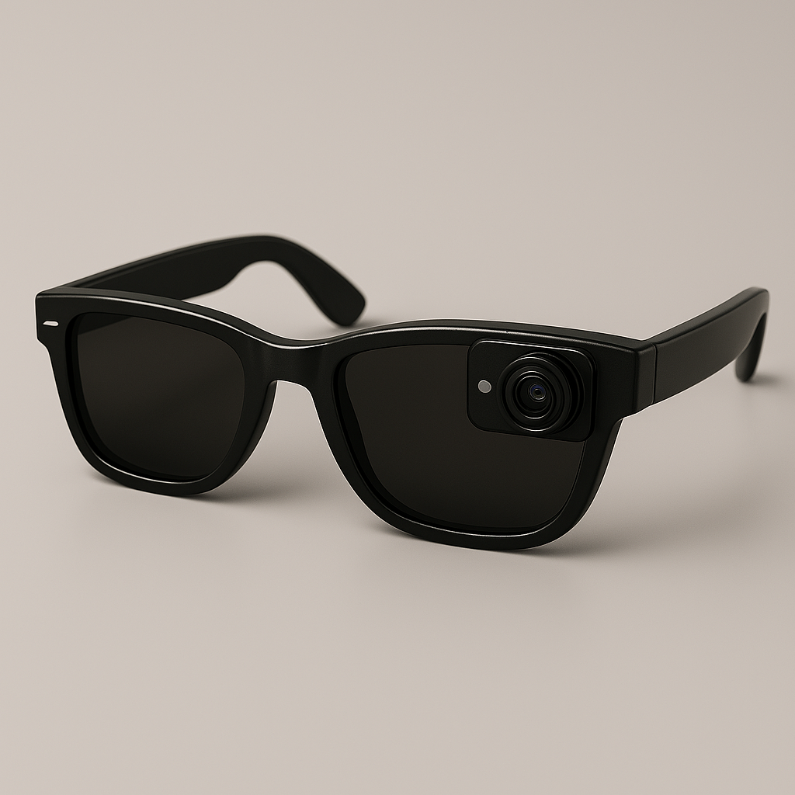

# Sova
Visual-Audio navigation for the visually impaired.

Check out our website: **https://sova-ai-app.web.app/**

# Our mission
Many buildings still depend on braille signage to provide directions for the visually impaired. However, braille requires
significant literacy, time, and physical effort to be read and installed. With the state of modern technology, Sova strives for a
more practical solution.

Our solution is simple. Users wear glasses fitted with a camera that automatically scans QR code carefully placed throughout a
building. When the camera detects a code, the system leverages the artifical intelligence of ElevenLabs to play a short audio
queue, which informs of the user of their current location and prompts them on where they want to go next.

No more stopping to read braille, no more relying on a tour guide, and no more risk of preventable injury. With this device, the
visually impaired can navigate buildings like anyone else.

*The future of navigation for the visually impaired is here. Do you want to be a part of it?*

